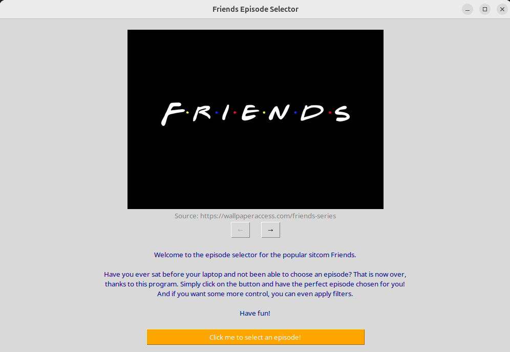
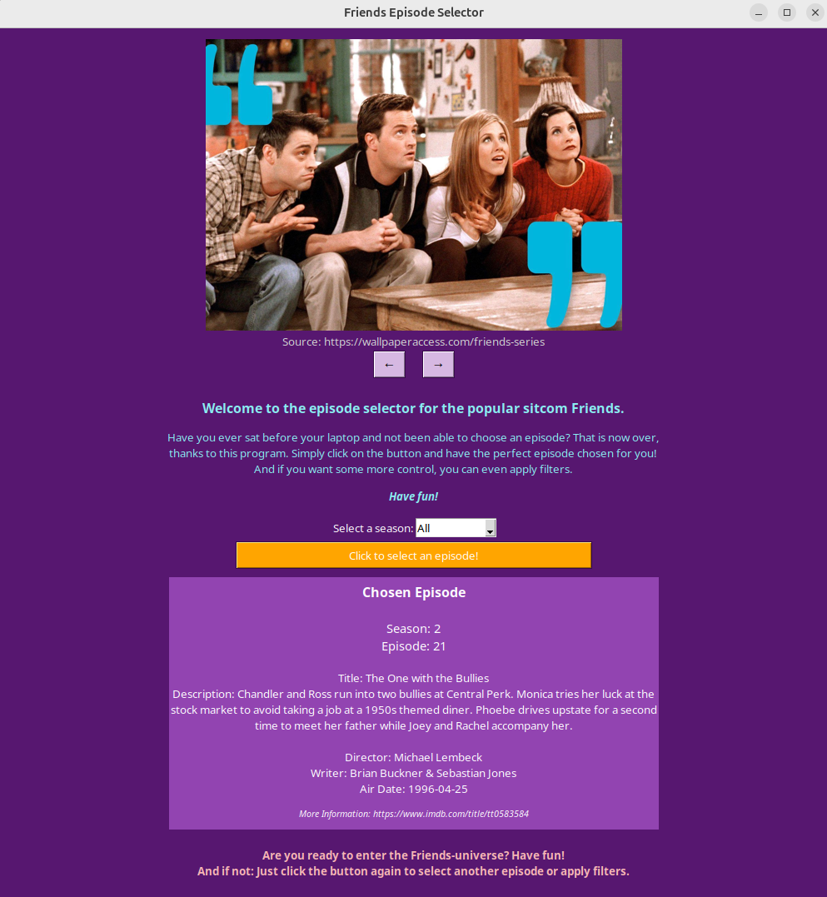
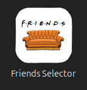

# Friends Sitcom Episode Selector

This is a fun little project I implemented because I am a big fan of the Friends sitcom. Since the TV show is my all-time favorite comfort series, I wanted to implement a little episode selector to have some fun with choosing what episodes to watch.

    
_Image 1: GUI - Main Window_

Also, this was my first dive into GUI development (in general and with Tkinter), so I took it as a learning opportunity - but do not expect professional or perfect code here.

The data used is from Kaggle: https://www.kaggle.com/datasets/thebumpkin/ultimate-friends-tv-sitcom-dataset?resource=download

It contains information on the season, episode number (both seasonally and overall), the episodes title and description as well as the director, the writer, the air date and a link to the IMDb page with further information.

## Manual Installation

The repository contains a `requirements.txt` file that can be run (ideally in a program-specific virtual environment) to install all needed packages. Also, you need to ensure that Tkinter works on your machine (should be installed already with your Python version, otherwise: sudo apt install python3-tk (Linux Ubuntu)). 

Afterwards, the program works by simply running the main Python script `episode_selector.py`. This then opens a graphical user interface (= GUI) where one can randomly chose an episode to watch and play around with an image gallery.    
The program also contains an option to display the chosen episode and its details in a pop-up window instead of in the main window. You can find more information on this in the main code file.

    
_Image 2: GUI - Main Window After Selecting an Episode_

### Create Application Launcher Icon (Linux Ubuntu)

Furthermore, the repository contains a template for a shell skript that runs the program. This can then be used to create a new application launcher icon. To do this, follow these steps:

1. Create a file with a `.desktop` extension in your `~/.local/share/applications` directory, for example `~/.local/share/applications/friends.desktop`

2. In the file, include at least the following lines (template), which tell the desktop how to launch the application:

    ```
    [Desktop Entry]
    Name=Friends Selector
    Type=Application
    Comment=Launches the Friends Sitcom Episode Selector, a program coded in Python
    Exec=#pathway to the shell script (.../friends_selector.sh)
    Icon=#pathway to the application icon (i.e. ...images/application_icon2.png; included in the repository)
    ```

After saving and exiting the .desktop file, it should automatically and within seconds appear in the menu system and be searchable.

    
_Image 3: Application Launcher Icon_

## To Dos

- [x] randomized episode selection
- [x] create GUI
- [x] pipe requirements.txt
- [x] season filter
- [ ] advanced filter options (i.e. based on contents of the description, specific directors etc.)
- [x] create application launcher icon